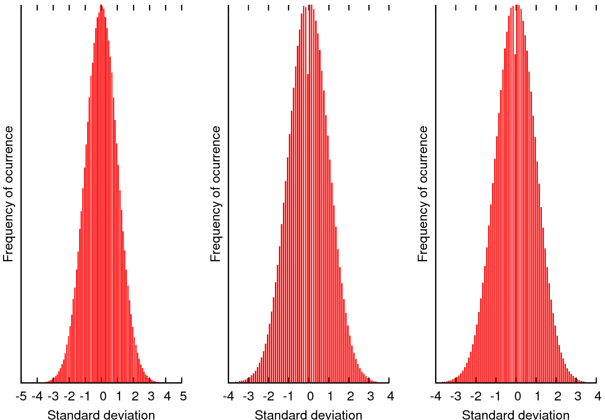

# Gaussian Pseudo-random Generation Numbers (SIMD Optimized)
Box-Muller and Ziggurat algorithms are Gaussian Pseudo-random number generation methods which are SIMD optimized.
Those methods are used in OpenAirInterface in order to generate the noise in the multipath channel. The multipath channel uses the sinc-interpolated Tapped Delay Line Model (TDL) with a reduced set of taps.
Box-Muller SSE, Box-Muller AVX, Ziggurat SSE and Ziggurat AVX generators achieved an improvement of 3.77, 7.54, 3.92 and 7.84 times respectively, compared to their non-optimized methods.
Gaussian pseudo-random number generators and physical layer optimizations made possible to achieve real-time FULL physical layer emulations in the frequency domain, critical for large scale scenarios.

When running ./boxmuller or ./ziggurat, the program will generate 3 files called plot.out, plot4.out and plot8.out. If you want to reduce the size of these files, please go to boxmuller.c or ziggurat.c files and reduce the value of the second FOR().

1. Math Kernel Library downloaded from https://software.intel.com/en-us/mkl.
2. Math functions are inspired from https://github.com/miloyip/normaldist-benchmark.

 
# Prerequisites
1. Intall the Math Kernel Library (MKL) from Intel: source l_mkl_2018.3.222/./install.sh
2. Run the script compilervars: source /opt/intel/bin/./compilervars.sh intel64

# Buil and Run Box-Muller
1. gcc -o boxmuller boxmuller.c gaussdouble.c display.c -lm -mavx2 -lmkl_intel_lp64 -lmkl_sequential -lmkl_core -lpthread
2. ./boxmuller

# Build and Run Ziggurat
1. gcc -o ziggurat ziggurat.c gaussdouble.c display.c -lm -mavx2 -lmkl_intel_lp64 -lmkl_sequential -lmkl_core -lpthread
2. ./ziggurat

## References
[1] G. E. P. Box and Mervin E. Muller, A Note on the Generation of Random Normal Deviates, The Annals of Mathematical Statistics (1958), Vol. 29, No. 2 pp. 610–611.

[2] Marsaglia, George, and Wai Wan Tsang. "The ziggurat method for generating random variables." Journal of statistical software 5.8 (2000): 1-7.
